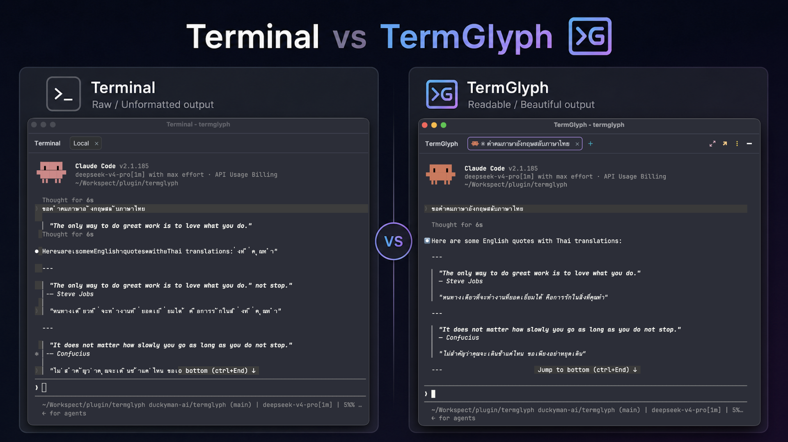

# Claude Code Glyph

<b>A terminal tool window for IntelliJ-based IDEs that renders Claude Code cleanly, and reflects its live status in the tab and a status chip.</b>

Runs on <b>macOS</b> and <b>Windows</b>.

Claude Code Glyph runs [xterm.js](https://xtermjs.org/) 6 inside the IDE's **JCEF** (Chromium Embedded) browser. xterm.js counts terminal columns precisely, so Claude Code's input box, borders, and dense output render cleanly — without the overlap and drift a column-imprecise terminal causes.

It's a *companion* to the IDE's built-in terminal — that one stays fully available.

---

## Features

**Built for Claude Code**

- **Profiles** — launch each session from a chosen `settings.json` (model, permission-mode, env vars, isolated config dir). Pick from the **+** button's popup.
- **Live status** — a gradient **beam** across the top, a colour-changing **tab**, and a **status chip** track whether Claude is *thinking*, *running a tool*, *waiting for permission*, or hit a *tool error*. The chip shows the model and context-window %.
- **Context & rate-limit awareness** — a context gauge in the chip, plus balloon warnings as the context window or 5-hour quota fills up.

**A better terminal**

- **Multiple tabs + native split** — Split Right / Down, exactly like the IDE's own terminal.
- **Find** (Cmd/Ctrl+F), **copy / paste / clear**.
- **Fast** — WebGL renderer, output batching.
- **Tab icons & titles follow the running process.**
- **Follows your IDE theme** — colours from the editor scheme; truecolor advertised.
- **Settings** — *Settings → Tools → Claude Code Glyph*.

## Status colours

| State | Beam / Tab |
|-------|-----------|
| Thinking / Running a tool | purple → blue |
| Waiting (permission / input) | amber |
| Tool error | red |
| Near limit (context ≥ 80% / 5h quota) | red → orange |
| Idle | blends in |

The beam and tab are independent toggles in Settings.

## Requirements

Claude Code Glyph renders through **JCEF**, bundled with some IDEs and optional on others.

| IDE | JCEF |
|-----|------|
| IntelliJ IDEA Ultimate / pro IDEs | ✅ built-in |
| IntelliJ IDEA Community | ❌ not available |
| Android Studio 2026.1.1+ | install "Web Browser (JCEF)" |

Minimum IDE: **2025.3**. If JCEF is missing, the tool window shows an install banner instead of the terminal.

## Usage

| Action | Shortcut |
|--------|----------|
| New tab / start a session | **+** beside the tabs |
| Close tab | **×** on the tab |
| Split | right-click → **Split Right / Down** |
| Find | **Cmd+F** (mac) / **Ctrl+F** |
| Copy | **Cmd+C** (mac) / **Ctrl+Shift+C** |
| Paste | right-click → **Paste** |
| Clear screen | **Cmd+K** (mac) / **Ctrl+K** |
| Multi-line input | **Shift+Enter** |
| Settings | gear (⋮) → **Settings…** |

Each terminal opens at the **project folder**. The first tab is always a Claude session.

## Limitations

- **Remote Development / Gateway / SSH / dev-containers** — not supported; desktop-only.
- **Active tab colour on the New UI / Islands theme** — the colour-tab effect renders only on inactive tabs (a platform limit); when a tab is active the beam across the top still shows the state.

## For developers

Built with the [IntelliJ Platform Gradle Plugin 2.x](https://plugins.jetbrains.com/docs/intellij/tools-intellij-platform-gradle-plugin.html) on Gradle 9, Kotlin 2.4, JBR 17. Third-party: [xterm.js](https://xtermjs.org/) + addons (fit, unicode11, webgl).

## License

[MIT License](LICENSE) — © 2026 Workspect. Forked from [TermGlyph](https://github.com/duckyman-ai/termglyph) (© 2026 Duckyman, MIT).

---

*An independent project, not affiliated with or endorsed by JetBrains, Anthropic, or the xterm.js project.*
